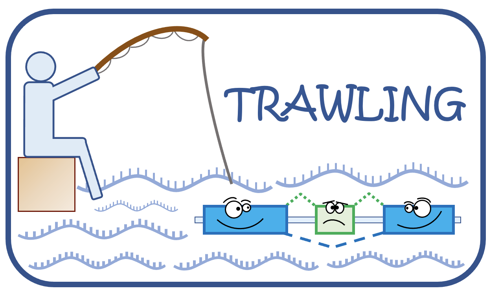

# TRAWLING
TRAWLING: a Transcriptome Reference AWare of spLicING events
===================

<p>
  
</p>


# Overview

TRAWLING is a Transcriptome Reference AWare of spLicING events. TRAWLING simplifies the identification of splicing events from RNA-seq data in a simple and fast way, while leveraging the suite of tools developed for alignment-free methods (e.g. Kallisto (Bray et al., 2016), Salmon (Patro et al., 2017), Alevin (Srivastava et al., 2019)). In addition, it allows the aggregation of read counts based on the donor and acceptor splice motifs. 


# Prerequisites and dependencies

- gffread
- bedtools
- r-base=3.6
- r-tidyverse
- r-rgb
- r-dplyr                      

# How does it work?


**Installation**


The easiest way to install all dependencies is with conda.
```
conda env create -f TRAWLING_env.yaml                                                                                                         
```    

**Set up configuration file**


Modify ``config.file`` as necessary. In particular, you need to specify the following variables:

- ``output``: output directory path;
- ``typeS``: '3prim' for 3' sequencing or 'bulk' for bulk-RNAseq;
- ``n``: the number of nucleotides within each exon that are included respective to the starting and ending position of the intron (see Material and Method of the paper). Typically, ``n`` is set to the read length minus one read, or minus up to 10% of the read length.


**Build TRAWLING**


```
./build_TRAWLING.sh config.file                                                                                                         
```    

**Output**


Once done, the pipeline should generate an *output* directory with the following folders:

    output
  	├── reference 
  	├── tmp
  	├── gtf			 
  	└── fasta

- ``reference``: gtf and fasta file retrieved from Gencode (Ratajczak et al. (2021));
- ``tmp``: temporary folder;
- ``gtf``: gtf and transcript's annotation files (generated for gencode and TRAWLING references);
- ``fasta``: transcript reference fasta and trascript to gene files (generated for gencode and TRAWLING references).

# Citation


If you use this code, please cite the following paper:


Noemi Di Nanni, Alejandro Reyes, Daniel Ho, Robert Ihry, Audrey Kauffmann, Eric Y. Durand, Antoine de Weck. "TRAWLING: a Transcriptome Reference Aware of spLIciNG events."
